# Attio Rails - Concepts & Architecture

## Table of Contents
- [Core Concepts](#core-concepts)
- [Architecture Overview](#architecture-overview)
- [Sync Flow](#sync-flow)
- [Batch Processing](#batch-processing)
- [Error Handling & Retry Strategy](#error-handling--retry-strategy)
- [Testing Strategy](#testing-strategy)

## Core Concepts

### 1. ActiveRecord Integration Pattern

The gem uses the **Concern pattern** to mix functionality into ActiveRecord models. This provides a clean, Rails-idiomatic interface:

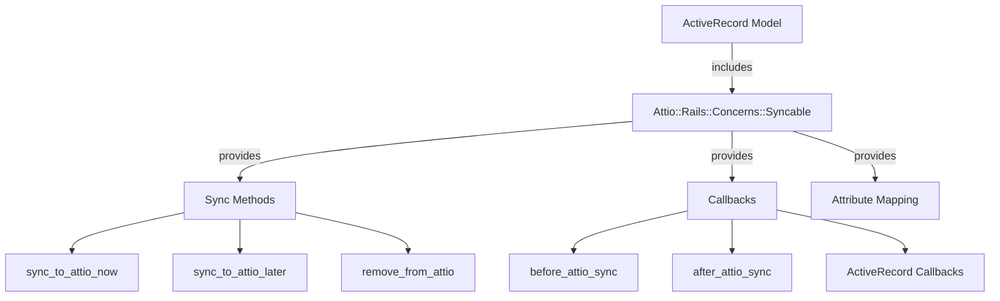

### 2. Attribute Mapping System

The attribute mapping system supports multiple mapping strategies:

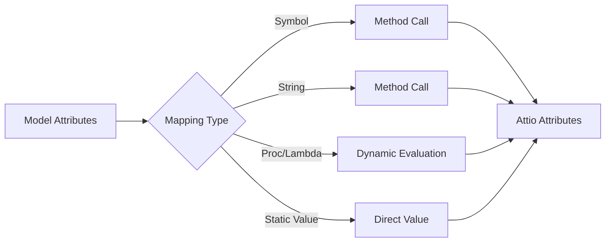

**Example mappings:**
```ruby
{
  email: :email_address,           # Symbol -> calls model.email_address
  name: "full_name",               # String -> calls model.full_name
  type: "customer",                # Static -> always "customer"
  count: ->(m) { m.items.count }  # Lambda -> evaluated dynamically
}
```

## Architecture Overview

### System Components

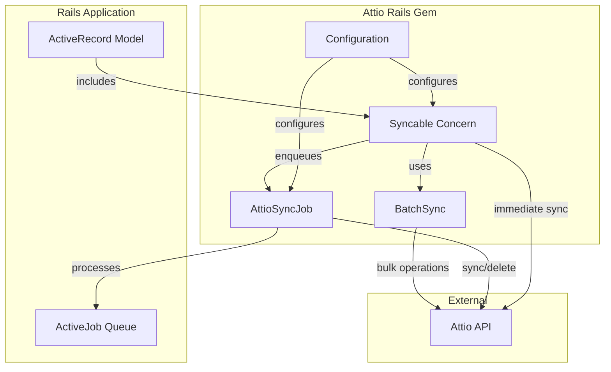

## Sync Flow

### Automatic Sync Lifecycle

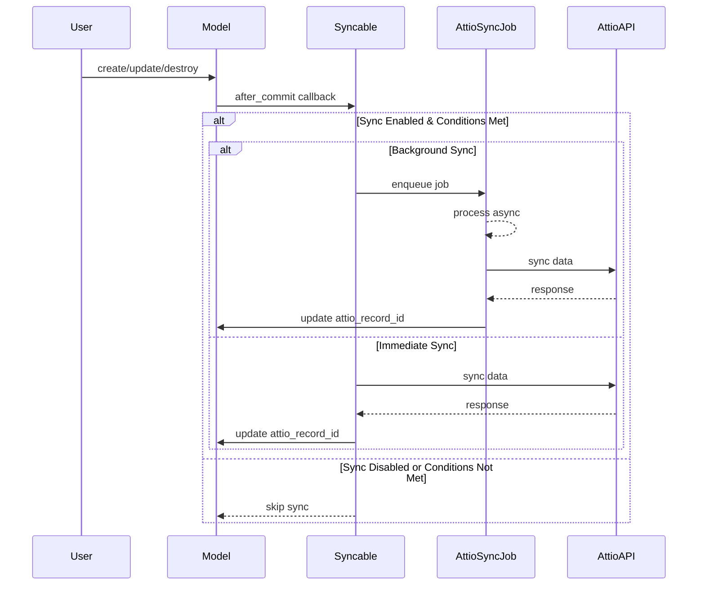

### Manual Sync Options

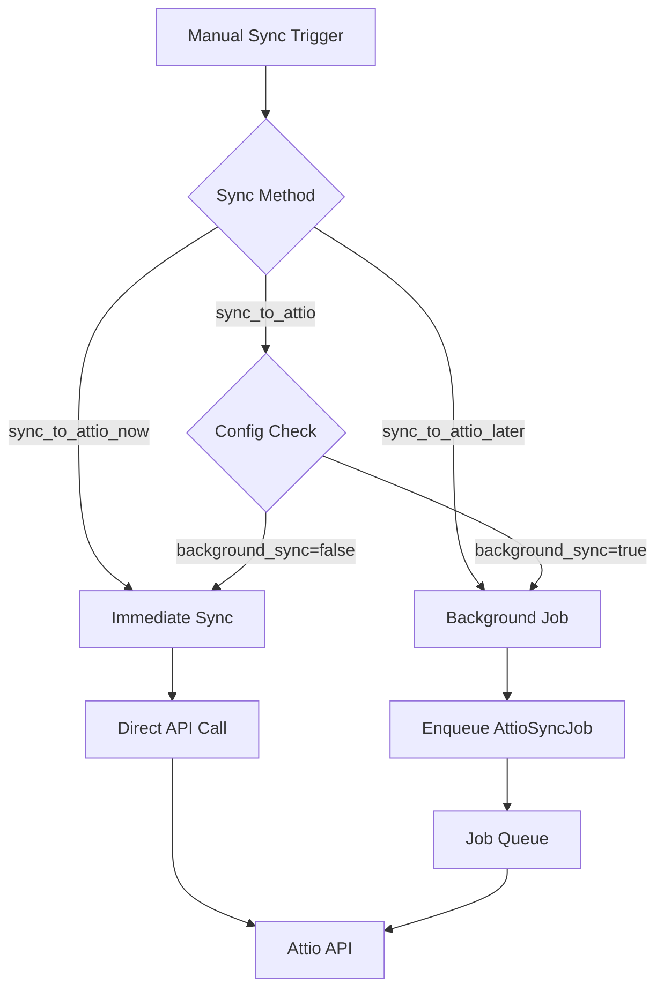

## Batch Processing

### BatchSync Flow

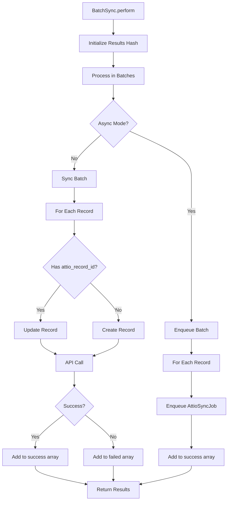

### Batch Processing Strategies

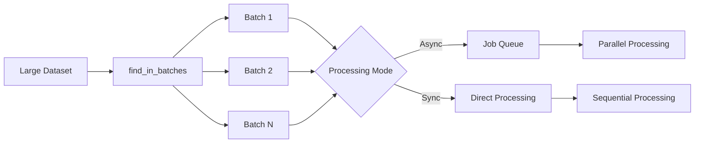

## Error Handling & Retry Strategy

### Error Flow

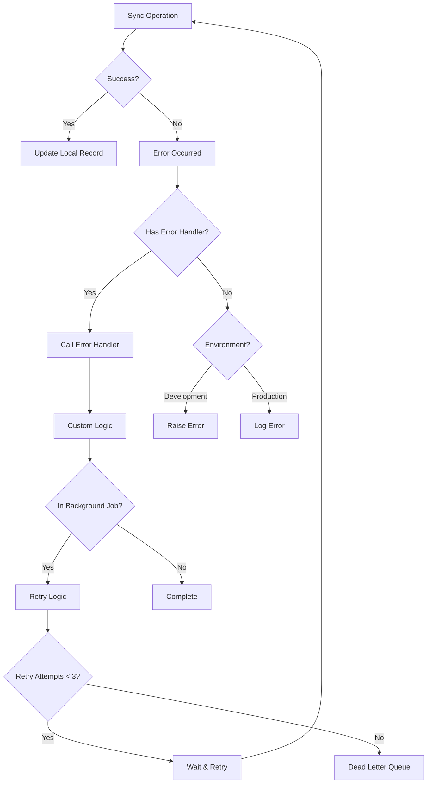

### Retry Strategy with ActiveJob

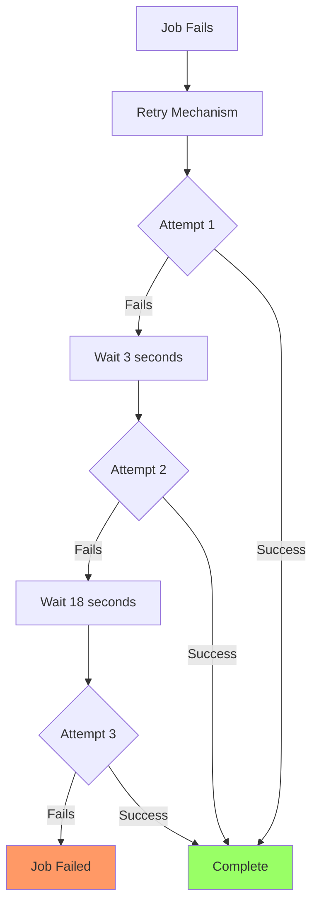

## Testing Strategy

### Test Double Architecture

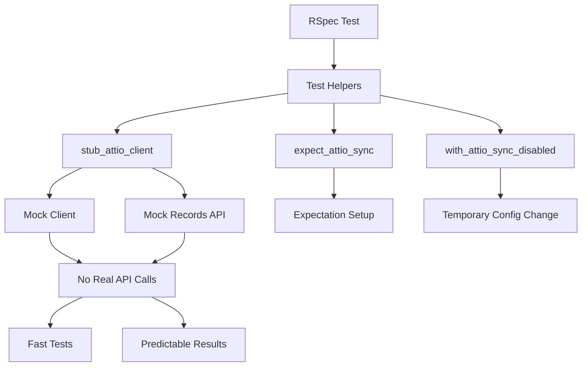

### Testing Layers

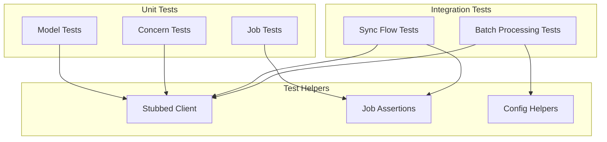

## Configuration Cascade

### Configuration Priority

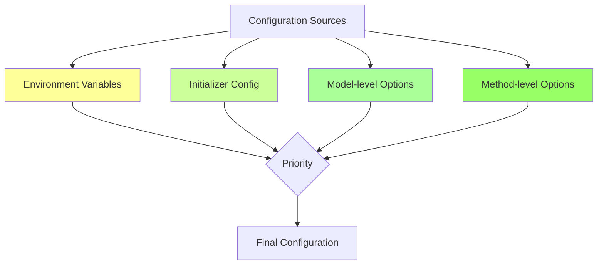

Priority order (highest to lowest):
1. Method-level options (e.g., `sync_to_attio_now(force: true)`)
2. Model-level options (e.g., `syncs_with_attio 'people', if: :active?`)
3. Initializer configuration (e.g., `config.background_sync = true`)
4. Environment variables (e.g., `ATTIO_API_KEY`)

## Data Flow Transformations

### Transform Pipeline

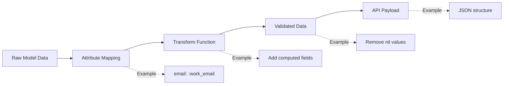

### Callback Chain

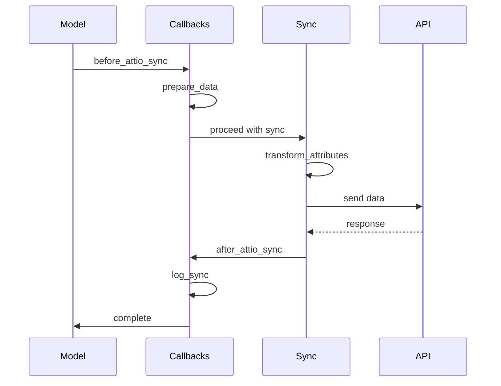

## Performance Considerations

### Optimization Strategies

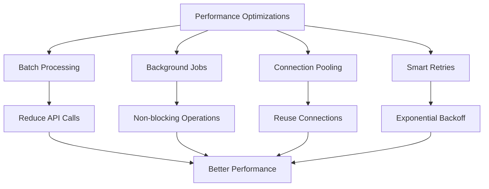

### Load Distribution

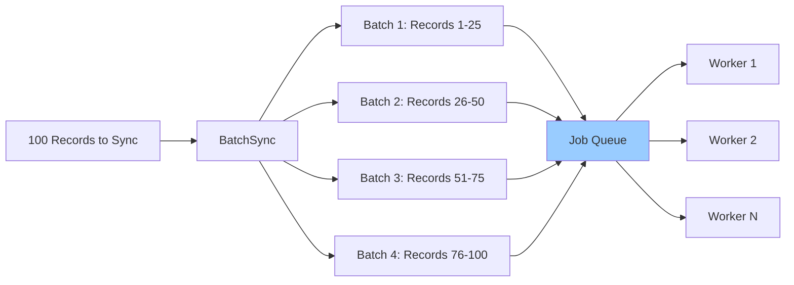

## Best Practices

### Recommended Patterns

1. **Use Background Sync for Production**
   - Prevents blocking web requests
   - Provides automatic retry on failure
   - Better user experience

2. **Implement Error Handlers**
   - Log errors to monitoring services
   - Gracefully handle API downtime
   - Notify administrators of issues

3. **Optimize Attribute Mapping**
   - Only sync necessary fields
   - Use transforms to reduce payload size
   - Cache computed values when possible

4. **Test Thoroughly**
   - Use provided test helpers
   - Mock external API calls
   - Test error scenarios

5. **Monitor Performance**
   - Track sync success rates
   - Monitor job queue depth
   - Alert on repeated failures